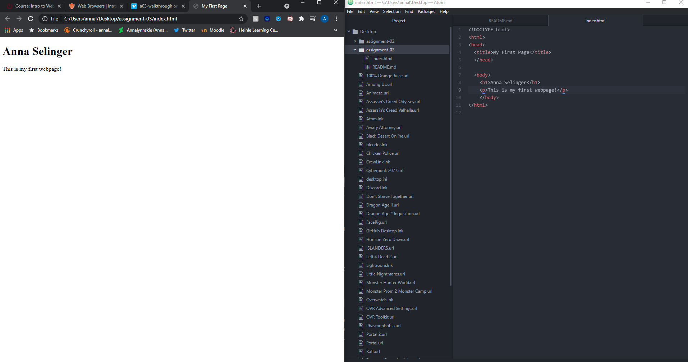

The browser sends and interprets requests for the page and displays them. Browsers have a rendering engines and displays the interpretations. The browser engine communicates with the servers and the rendering engine. cookies and local storage are stored in the browsers data storage. because browsers use different rendering engines that pages can look different between browsers. I currently use Chrome on my computer and safari on my phone.

Markup language decides the structure of a page, focusing on the text contents. html is a commonly used markup language that works as the foundation of a page's content. Other things can be added after it's set. it's easy to learn and highly used as well as seen as the standard language. Its written un elements that are small blocks that start and end with tags.

