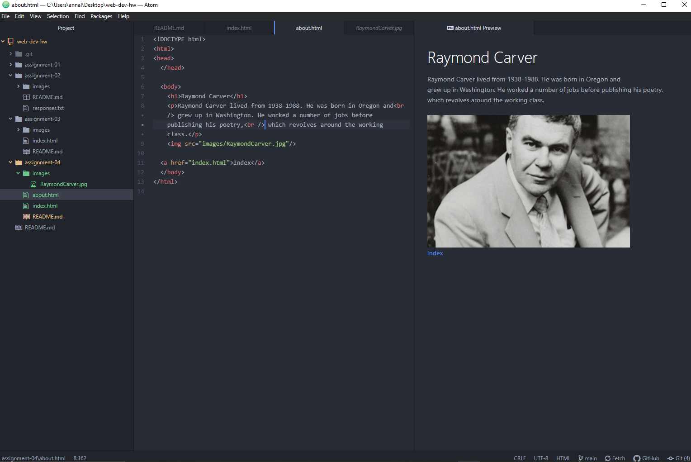

I went back 10 years on youtube using the wayback machine. The site looks very simple then with very little care in style. On the youtube page now there is a lot more effort in organization and the style of the site and ease of use.
The Git Module was fairly simple and easy to learn and use. Being able to make all the changes through atom and just pushing buttons in the app makes updating things really easy.

