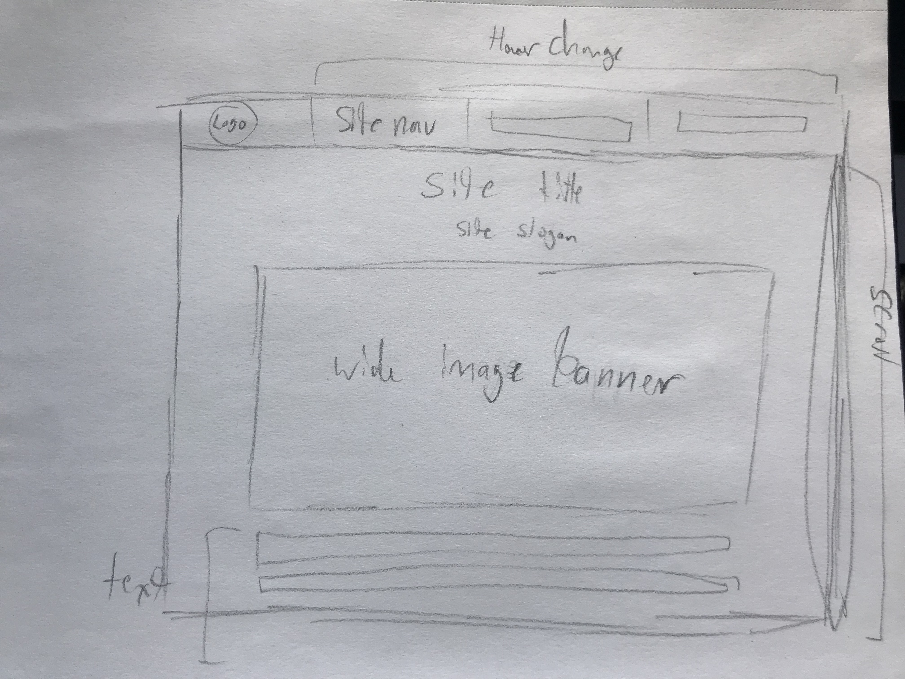

Padding is the space between the element and the content in the element. A border is a frame around the element. the margin is the space between the element and other elements.

I started with setting up the page with the main and meta elements and added in the text and heading as well as the links. After that I created divs and set up the navigation bar so that it was fixed and certain elements would change when hovered over. I made sure the rest of the content didn't get covered by the bar and added in the float element. The float element confused me the most and I'm not sure if I really got it. Most of the rest of positioning was trial and error and I eventually figured it out.
